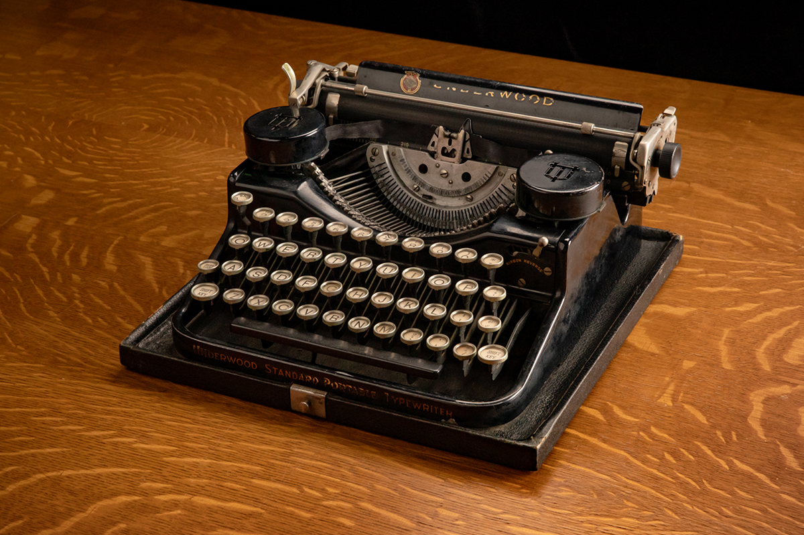
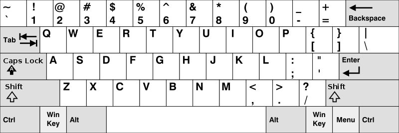
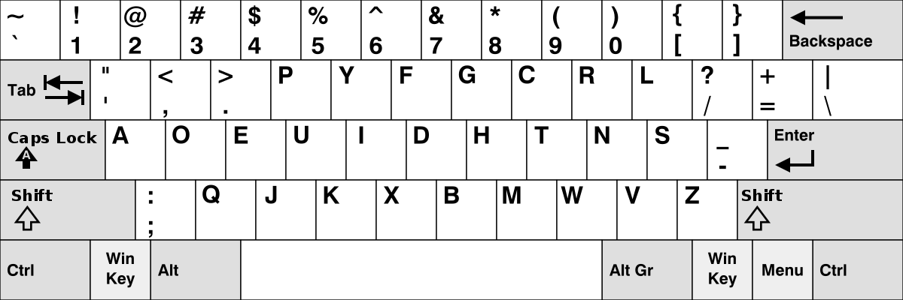
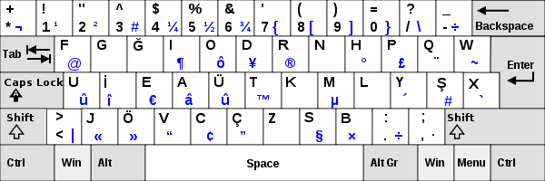
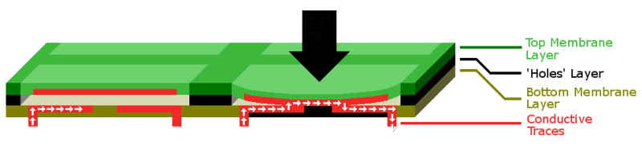
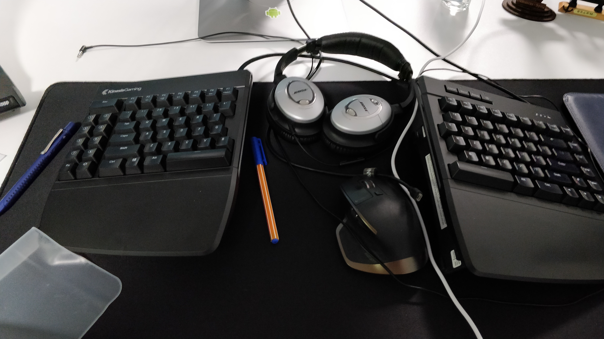
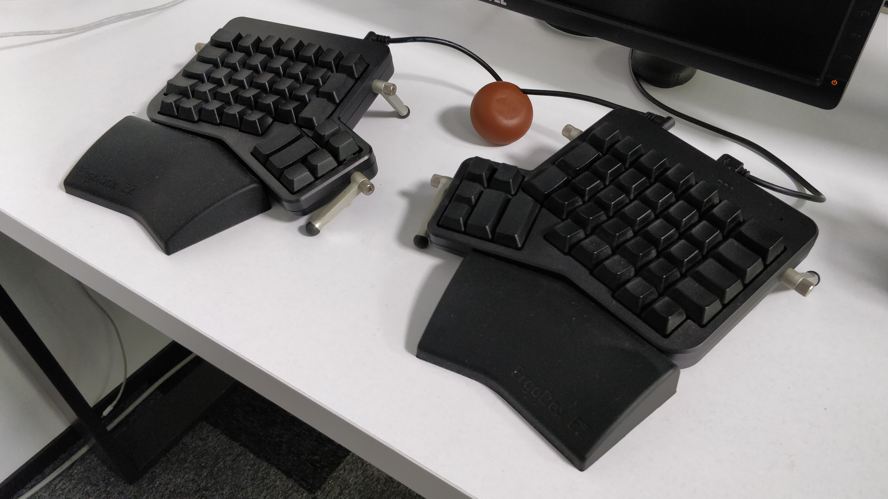
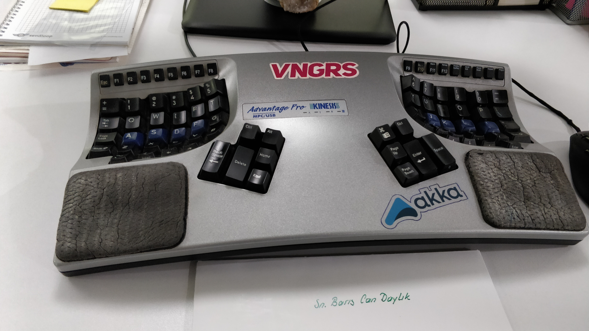

# Keyboards

Keyboard is a device that lets us input text to computers. They typically use buttons and keys for letters, numbers and symbols. They also provide a combination of these for special actions and capabilities.

## 1. History

They began as typewriters. First one was patented in 1868 by Christopher Latham Sholes. Then, Remington Company began mass marketing them in 1877.

## 2. Layouts

The well known QWERTY keyboard layout is believed to be developed by Sholes and his partner James Densmore in 1878 to overcome physical limitations of mechanical technology at the time.

As technology improved, other layouts emerged. Dvorak is another layout that was patented in 1936 and even today, there remains a tiny minority of people who use Dvorak layout.

In 1955, İhsan Yener designed a custom layout for Turkish called Turkish F Keyboard. It was designed by the investigation of letter frequencies in Turkish so that it provides a balanced effort on both hands.

## 3. Types and Technology

There are many types, sizes and styles of keyboards such as standard, laptop-size, flexible, handheld, thumb-sized, software (on-screen), projection etc. They may be wired or wireless.

Most common interface for wired keyboards is USB. Wireless keyboards may work over Bluetooth or radio frequency (RF).

They detect input in different ways too. One of these is membrane. Membrane keyboards have a rubber/silicone shell under them and when a key is pressed, the pressure completes the circuit so electricty can flow. Membrane keyboards are usually lightweight and quiet.

Another is mechanical. Mechanical keyboards are considered to be nerdy and usually much more expensive but they provide a much better feel, typing performance, accuracy and durability. In mechanical keyboards, each key has a mechanism (switch) of its own that trigger the input. Characteristics of these switches differ from type to type and brand to brand. Some are quiet and soft, some are clicky and provide a stronger feedback when pressed. Here are some Cherry MX style mechanical keyboard switches:

| Cherry MX Black                      | Cherry MX Blue                                          | Cherry MX Brown                                         | Cherry MX Red                                    |
| ------------------------------------ | ------------------------------------------------------- | ------------------------------------------------------- | ------------------------------------------------ |
|          |                              |                             |                        |
| Linear, good for gamers, smooth feel | Tactile, good for typing, has feedback and clicky sound | Light tactile, good for typing and gaming, has feedback | Similar to black but needs less force to actuate |

There are also more ergonomic keyboards, mostly designed to avoid having repetotove strain injuries (RSI) such as carpal tunnel syndrome. They come in different shapes and layouts. Some are split, some stay on an angle. Here are some of the keyboards from VNGRS office.

## Sources and Links

| Title                            | Link                                                         |
| -------------------------------- | ------------------------------------------------------------ |
| History of the Computer Keyboard | https://www.thoughtco.com/history-of-the-computer-keyboard-1991402 |
| Typewriter Photo                 | https://news.illinois.edu/view/6367/797226                   |
| QWERTY Layout                    | https://www.wikiwand.com/en/QWERTY                           |
| Dvorak Layout                    | https://www.wikiwand.com/en/Dvorak_Simplified_Keyboard       |
| Turkish F Layout                 | https://en.wikibooks.org/wiki/Turkish/Computing_in_Turkish   |
| Keyboard Types                   | http://ergonomictrends.com/different-types-of-computer-keyboards/ |
| Mechanical Keyboard Switches     | https://www.daskeyboard.com/blog/mechanical-keyboard-guide/  |
